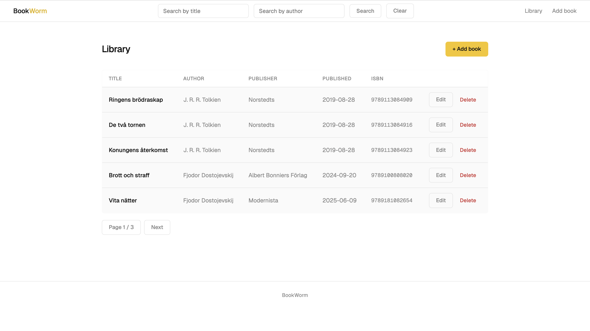
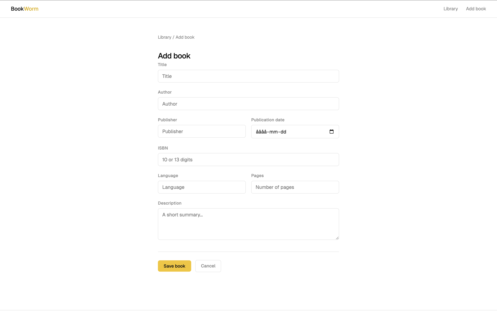
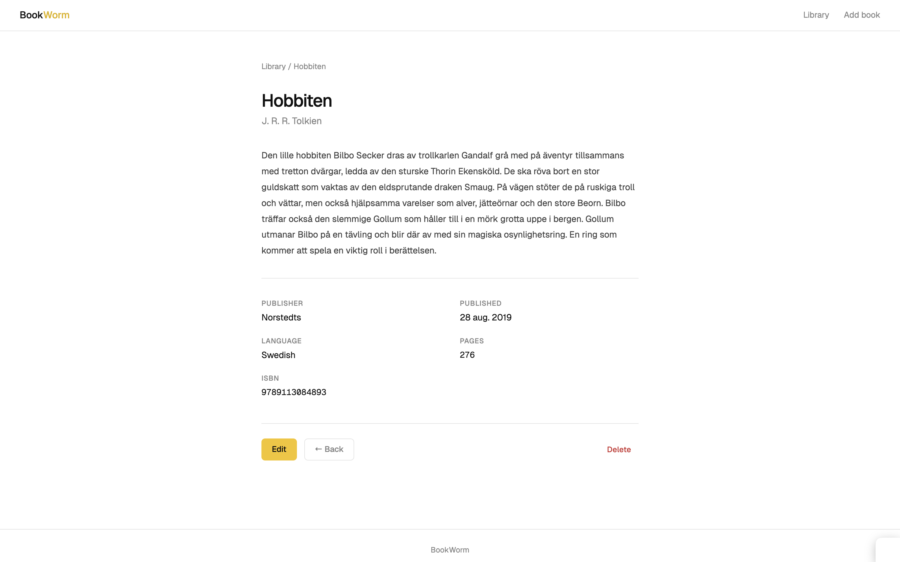

# BookWorm 📚
A personal book library manager built with Spring Boot!

BookWorm lets you keep track of your book collection — add, edit, search, and remove books through a clean web interface.







---

## Tech Stack

- **Java 25** with Spring Boot 4.0
- **Spring MVC** — handles web requests and routing
- **Spring Data JPA** — database access via repository pattern
- **Thymeleaf** — server-side HTML templating
- **MySQL & H2** — relational database (MySQL runs via Docker, H2 for local dev/testing)
- **Lombok** — reduces boilerplate (getters, setters, constructors)
- **Jakarta Validation** — form input validation
- **Spring Boot Docker Compose** — automatic container management during development

---

## Features

- List all books with pagination
- Add a new book with title, author, and description
- Edit or delete existing books
- View individual book details
- Search by title, author, or both
- Input validation with user-friendly error messages
- Custom 404 error page
- Automatic database initialization with sample data

---

## Prerequisites

- Java 25
- Maven
- Docker and Docker Compose

---

## Getting Started

**1. Clone the repository**

```bash
git clone https://github.com/your-username/bookworm.git
cd bookworm
```

**2. Start the database**

```bash
docker compose up -d
```

**3. Run the application**

```bash
./mvnw spring-boot:run
```

**4. Open in your browser**

```
http://localhost:8080/books
```

---

## Project Structure

```
src/
└── main/
    ├── java/org/example/bookworm/
    │   ├── books/           # Core logic for book management
    │   │   ├── dto/         # Data transfer objects
    │   │   └── ...          # Controllers, services, repositories
    │   └── BookwormApplication.java
    └── resources/
        ├── templates/       # Thymeleaf HTML pages
        ├── application.properties
        └── data.sql         # Sample data
```

---

## Running Tests

```bash
./mvnw test
```

Tests cover the mapper, service layer (with Mockito), and controller (with MockMvc).

---
